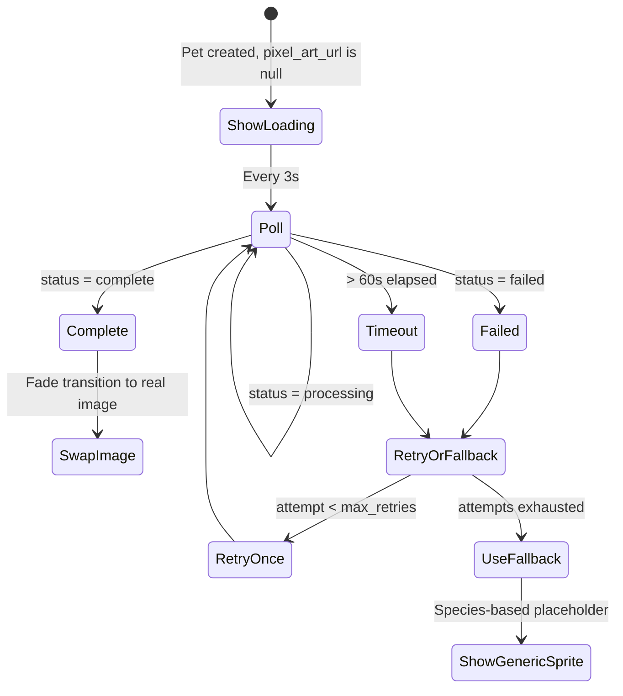
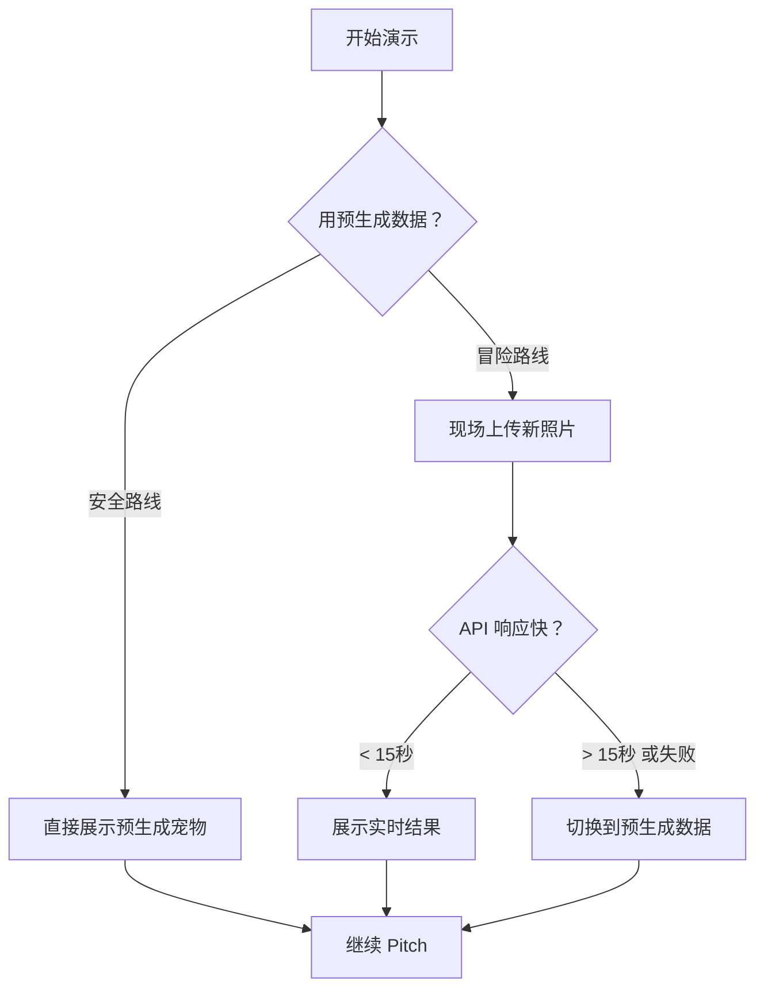

# Pawdise — Product Specification

> [!abstract] Core Experience
> 让失去宠物的主人，可以在另一个世界里重新看见它。
> User uploads pet photo → Generate pixel art AI pet image → Pet lives in an independent virtual world → Owner checks in anytime to see what it's doing. ==No dialogue needed.==

---

## Table of Contents

- [[#Core Experience]]
- [[#Tech Stack]]
- [[#Pages & User Flows]]
- [[#Data Models]]
- [[#API Routes]]
- [[#Pixel Art Generation & Polling State Machine]]
- [[#Emotional Loading Page]]
- [[#Auth & Session Strategy]]
- [[#Visual Design System]]
- [[#Pitfall Warnings]]
- [[#10-Hour Timeline]]
- [[#Pre-generated Fallback Strategy]]
- [[#Demo Tips]]

---

## Core Experience

1. User lands on Pawdise — ==starts immediately without signing up==
2. 3-step form: pet info → personality → story + photo upload
3. Submit → emotional loading screen (*"正在为 Mochi 搭建她的新家..."*)
4. AI generates a pixel art scene: the pet living in its own virtual world
5. User sees their pet in a peaceful scene — playing, napping, exploring
6. Each visit shows the pet doing something different (time-based or random activity)
7. ==No chat, no dialogue== — just watching your pet live happily in another world
8. User can sign in with Google to save their pet permanently

---

## Tech Stack

| Layer | Technology | Reason |
|:------|:-----------|:-------|
| Frontend + API | **Next.js 14** (App Router) | Full-stack, fast to deploy, API routes built-in |
| Deployment | **Vercel** | Zero-config Next.js deployment |
| Database | **Supabase** (Postgres) | Managed SQL, generous free tier, fast setup |
| File storage | **Supabase Storage** | Co-located with DB, handles photo + pixel art |
| Auth | **Supabase Auth** + Google OAuth | Built-in Google OAuth, integrates with Supabase DB natively |
| Text AI | **Anthropic Claude API** (`claude-sonnet-4-6`) | Generates pet activity descriptions & scene narratives |
| Image AI | **Replicate** | Pixel art generation from uploaded photos |
| Styling | **Tailwind CSS** | Fast to build consistent warm/cozy UI |

---

## Pages & User Flows

### 1. Landing Page (`/`)

- Hero: app name, tagline (*"A place where your pet lives on"*)
- Brief description of what Pawdise does
- Single CTA button: **"Create my pet"** → goes to `/create`
- No auth required

### 2. Pet Creation (`/create`)

Multi-step form (3 steps):

> [!example]- Step 1 — About your pet
> - **Pet name** *(required)*
> - **Species:** Dog / Cat / Bird / Rabbit / Other *(required)*
> - **Breed** *(optional text input)*

> [!example]- Step 2 — Their personality
> - **Personality traits** (textarea): *"e.g. Playful, stubborn, loved cuddles, scared of thunderstorms"*
> - **Favorite things & habits** (textarea): *"e.g. Always slept on the left pillow, loved tuna treats, went crazy for the red laser pointer"*

> [!example]- Step 3 — Their story + photo
> - **Free-form memory / bio** (textarea): *"Tell their story in your own words"*
> - **Photo upload** *(optional)*: drag-and-drop or file picker, accepts JPG/PNG, max 5MB
> - **"Bring \[name\] to life"** submit button

> [!info] On Submit
> - Creates a pet record in Supabase with a guest `session_id` (UUID stored in `localStorage`)
> - If photo uploaded: stores original in Supabase Storage, kicks off Replicate pixel art job
> - Redirects to `/pet/[id]` → shows emotional loading page while generating

### 3. Emotional Loading Page (`/pet/[id]` — generating state)

See [[#Emotional Loading Page]] for detailed design.

### 4. Main Pet Page (`/pet/[id]` — ready state)

Layout (mobile-first, vertical stack):

- **Scene image**: pixel art of the pet in its virtual world (cosmic meadow, sunny garden, etc.)
- **Pet name + species badge** below the scene
- **Activity status**: a short narrative of what the pet is doing right now
  - *"Mochi 正在草地上追蝴蝶，看起来很开心"*
  - *"Biscuit found a sunny spot by the river and is taking a nap"*
- **Scene details**: time of day in the pet's world, weather, mood
- **Sign in** button in navbar for permanent save

> [!note] No chat interface
> The pet lives independently. The owner is a ==quiet observer== — they open the page to check on their pet, not to interact. This is intentional: the emotional core is *seeing* your pet happy and at peace.

### 5. Post-Auth Redirect

After Google sign-in, if a `session_id` exists in localStorage with an unclaimed pet:

1. Associate the pet with the new `user_id` in Supabase
2. Clear the `session_id` from localStorage
3. Redirect back to `/pet/[id]` — seamless

---

## Data Models

### `pets` table

```sql
CREATE TABLE pets (
  id                UUID PRIMARY KEY DEFAULT gen_random_uuid(),
  user_id           UUID REFERENCES auth.users(id) ON DELETE SET NULL,
  session_id        TEXT,                    -- for guest users
  name              TEXT NOT NULL,
  species           TEXT NOT NULL,
  breed             TEXT,
  traits            TEXT,                    -- personality description
  habits            TEXT,                    -- favorite things & habits
  bio               TEXT,                    -- free-form story
  original_photo_url TEXT,                   -- Supabase Storage URL
  pixel_art_url     TEXT,                    -- Supabase Storage URL (generated)
  replicate_job_id  TEXT,                    -- to poll generation status
  current_activity  TEXT,                    -- what the pet is doing right now
  current_scene     TEXT,                    -- scene description
  last_activity_at  TIMESTAMPTZ,            -- when the activity was last refreshed
  created_at        TIMESTAMPTZ DEFAULT now()
);
```

> [!note] No `messages` table
> Since there is no chat feature, we don't need a messages table. The pet's activities are generated on-demand or on a time-based refresh.

---

## API Routes

### `POST /api/pets`

Create a new pet. Body: `{ name, species, breed, traits, habits, bio, session_id }`.
Returns `{ pet_id }`.

### `GET /api/pets/[id]`

Fetch pet profile + current activity + pixel art status.
Returns pet data including:
- `pixel_art_url` (null if still generating)
- `current_activity` and `current_scene`
- `replicate_job_id` for polling

### `POST /api/pets/[id]/claim`

Associate a guest pet with an authenticated user.
Body: `{ session_id }`. Verifies session_id matches, updates `user_id`.

### `POST /api/pets/[id]/upload-photo`

Accepts multipart form data with photo file.

1. Stores original in Supabase Storage
2. Kicks off Replicate pixel art generation job
3. Stores `replicate_job_id` on the pet record
4. Returns `{ original_photo_url, replicate_job_id }`

### `GET /api/pets/[id]/pixel-art-status`

Polls Replicate for job completion.

| Status | Action |
|:-------|:-------|
| `processing` | Still generating — keep polling |
| `complete` | Saves generated image to Supabase Storage, updates `pixel_art_url` |
| `failed` | See [[#Generation Failure Handling]] |

### `GET /api/pets/[id]/activity`

Generate or fetch the pet's current activity. Uses Claude to generate a scene description based on:
- Pet's personality, habits, bio
- Time of day
- Random seed for variety

Returns `{ activity, scene, generated_at }`.

---

## Pixel Art Generation & Polling State Machine

### Replicate Model

Use [`nerijs/pixel-art-xl`](https://replicate.com/nerijs/pixel-art-xl) on Replicate:

| Parameter | Value |
|:----------|:------|
| **Prompt** | `"pixel art portrait of a [breed] [species], 16-bit style, centered, clean background, cute, game sprite"` |
| **Input image** | User's uploaded photo (img2img, strength `0.6`) |
| **No photo fallback** | Text-to-image only using the same prompt |

### Polling State Machine



### Generation Failure Handling

> [!warning] 如果生成失败了怎么办？
> Pixel art generation can fail for several reasons: Replicate service down, model overloaded, invalid input image, timeout. The failure strategy has multiple layers:

**Layer 1 — Auto Retry (1x)**
- If the first attempt fails or times out (>60s), automatically submit one retry
- Use a different `seed` parameter to avoid identical failure

**Layer 2 — Prompt Fallback**
- If img2img fails, fall back to text-only generation (no input image)
- Use a more descriptive prompt with breed, color, and markings

**Layer 3 — Generic Sprite**
- If all generation fails, use a pre-bundled species-based pixel art sprite
- Static assets in `/public/sprites/dog.png`, `cat.png`, `bird.png`, `rabbit.png`, `other.png`
- ==No error shown to user== — the experience continues seamlessly

**Layer 4 — Demo Fallback**
- For hackathon demo: pre-generated high-quality results cached server-side
- See [[#Pre-generated Fallback Strategy]]

> [!tip] 用户感知
> 无论哪个 layer 触发，用户看到的都是连贯的体验。加载页面的温暖文字持续播放，最终图片以淡入效果出现。失败对用户应该是==完全透明的==。

---

## Emotional Loading Page

> [!important] 加载等待页面的情感化设计
> The loading page is not optional — it IS the experience during the wait. API calls can take 10-30 seconds. This page turns waiting into an emotional moment.

### Design

When the user submits the form and pixel art is generating:

**Visual Elements:**
- Soft gradient background (warm tones)
- Gentle floating particles or star animation
- A small placeholder sprite (species-based) with shimmer/pulse animation
- Progress dots or a soft loading indicator (not a progress bar — we don't know exact timing)

**Rotating Warm Messages** (change every 3-4 seconds):

```
"正在为 [name] 搭建她的新家..."
"[name] is exploring the meadow for the first time..."
"Finding the perfect sunny spot for [name]..."
"[name] 正在熟悉新的世界..."
"Almost there — [name] is settling in..."
"Planting flowers in [name]'s garden..."
```

**Transition to Ready:**
- When pixel art + activity are ready, the loading messages fade out
- The scene fades in with a gentle animation
- First activity text appears: *"[name] has arrived in their new world"*

### Technical Notes

- Messages are personalized with pet name (loaded from the creation response)
- Front-end polls `/api/pets/[id]/pixel-art-status` every 3 seconds
- Minimum display time: ==5 seconds== (even if generation is instant) — don't rush the emotional moment
- If >30 seconds: add a reassurance message (*"Still working on it — good things take time"*)

---

## Auth & Session Strategy

### Guest Session

> [!info] Guest Flow
> - On pet creation, generate a UUID `session_id` and store in `localStorage`
> - Pet record has `user_id = null` and `session_id = <uuid>`
> - Guest pets can be accessed at `/pet/[id]` from the same browser without auth
> - Guest pets expire after **30 days** (cron job or Supabase row-level TTL)

### Sign-In to Save

1. User clicks **Sign in** in the navbar
2. Supabase Auth handles Google OAuth flow
3. On callback, if `localStorage` has a `session_id`:
   - Call `POST /api/pets/[id]/claim` with the `session_id`
   - Pet's `user_id` is set, `session_id` cleared
4. User is now the ==permanent owner== of that pet

### Row Level Security (Supabase)

> [!tip] MVP Shortcut
> For MVP, this can be permissive (no RLS) since it's a hackathon demo.

---

## Visual Design System

> [!warning] 需要设计
> The visual design system needs to be fully designed. Below is a starting point based on the project's emotional direction.

### Design Direction

The visual language should communicate: ==warmth, peace, gentle nostalgia==. This is not a playful game — it's a quiet, beautiful space where someone's loved one lives on.

### Palette (Draft)

Two potential directions:

**Option A — Warm Amber (from original spec)**

| Token | Value | Usage |
|:------|:------|:------|
| `warm-bg` | `#FFFBF5` | Page background |
| `warm-surface` | `#FFF7ED` | Cards, containers |
| `warm-border` | `#FDE8CC` | Borders, dividers |
| `warm-accent` | `#F97316` | CTA buttons, highlights |
| `warm-text` | `#431407` | Primary text |
| `warm-muted` | `#9A3412` | Secondary text |

**Option B — Cosmic Nebula (from 项目规划)**

| Token | Value | Usage |
|:------|:------|:------|
| `cosmic-bg` | `#1A1035` | Page background |
| `cosmic-surface` | `#2D1B69` | Cards, containers |
| `cosmic-glow` | `#F5C842` | Warm gold accents, CTAs |
| `cosmic-text` | `#FAF7F2` | Primary text |
| `cosmic-muted` | `#B8A9D4` | Secondary text |
| `cosmic-accent` | `#7C5CBF` | Interactive elements |

> [!question] 待决定
> Which palette direction? Option A feels warm and earthly. Option B feels dreamy and otherworldly — more aligned with "another world" concept. Could also blend: warm tones for the creation flow, cosmic tones for the pet's world.

### Typography

- **Body:** `Inter` or `system-ui`
- **Headings:** `Inter` semibold
- Clean and readable — the pixel art carries the visual charm

### Radius & Shadows

- Rounded corners: `rounded-2xl` for cards, `rounded-full` for buttons
- Soft drop shadows with warm or purple tint depending on palette

### Responsive

- Mobile-first design
- Scene image scales to viewport width
- Touch-friendly spacing

---

## Pitfall Warnings

> [!danger] 坑 1：DALL-E / Replicate 生成的宠物可能完全不像原图
> 宠物长相还原度是整个 Demo 的情感核心。如果生成的不像，观众的感受会从"好感动"瞬间变成"这不是我的宠物"。
>
> **对策：**
> - 提前测试 ==大量 prompt 变体==，找到还原度最高的写法（加入毛色、花纹、体型等具体描述词）
> - 准备 **2-3 套预生成的高质量结果**作为 fallback
> - 如果时间允许，测试 img2img 方式（以原图为基础做风格迁移，而非纯文字描述生成）
> - 最坏情况：保留宠物原图 + AI 生成背景，==至少保证宠物本身是真实照片==

> [!danger] 坑 2：API 延迟会杀死体验
> 图片生成可能要 **10-30 秒**，加上 Claude 文字生成又是几秒。用户上传后盯着白屏等 30 秒，体验直接垮掉。
>
> **对策：**
> - ==加载等待页面==本身要成为情感体验的一部分（见 [[#Emotional Loading Page]]）
> - 图片和文字生成 ==并行调用==，不要串行等待
> - 后端用异步任务：前端轮询获取结果
> - 演示时优先走预生成缓存，==现场 API 调用只作为加分项==

> [!danger] 坑 3：前后端联调的"胶水活"会偷走时间
> 跨域（CORS）配置、图片上传处理、部署环境变量——这些"胶水活"单个都不难，但加起来 ==很容易吃掉 1-2 小时==。
>
> **对策：**
> - ==Hour 1 结束时==，前端必须能成功调通后端的一个端点，确认部署链路是通的
> - 图片上传用 base64 编码传 JSON，省掉 multipart 问题
> - 环境变量提前配好，==不要等到最后才发现没配==

> [!warning] 坑 4：Pixel Art 风格一致性
> 不同照片输入可能导致生成风格差异大。同一用户的宠物在不同场景里可能看起来像两只不同的动物。
>
> **对策：**
> - 固定 Replicate model 和参数（seed、strength、guidance_scale）
> - 使用统一的 prompt 模板
> - 如果时间允许，生成后做人工筛选

> [!warning] 坑 5：Supabase 冷启动 & 连接超时
> Supabase 免费 tier 的数据库可能在闲置后冷启动，第一次请求会慢 3-5 秒。
>
> **对策：**
> - 演示前 5 分钟先手动访问一次，唤醒数据库
> - 在加载页面设计中已覆盖这个延迟

> [!warning] 坑 6：移动端适配
> 评委可能在手机上看 demo。如果响应式没做好，印象分直接打折。
>
> **对策：**
> - 从一开始就 mobile-first 设计
> - 场景图片用 `max-width: 100%` + `object-fit: cover`
> - 测试至少 iPhone SE 和 iPhone 14 尺寸

---

## 10-Hour Timeline

### Phase 1 — 搭建骨架 + 打通链路 `Hour 0-1` (1h)

- [ ] Next.js 14 脚手架，部署到 Vercel
- [ ] Supabase 项目创建，`pets` 表建好
- [ ] 配好所有环境变量（Replicate key、Claude key、Supabase URL/key）
- [ ] 一个简单的 `GET /api/health` 能跑通
- [ ] ==确认 Vercel → Supabase 连接正常==

> [!warning] Hour 1 检查点
> 页面能在 Vercel 上访问，API route 能读写 Supabase。如果这步没通，==停下所有其他工作==先解决。

### Phase 2 — 后端核心 API `Hour 1-3` (2h)

- [ ] `POST /api/pets` — 创建宠物
- [ ] `GET /api/pets/[id]` — 获取宠物数据
- [ ] `POST /api/pets/[id]/upload-photo` — 照片上传到 Supabase Storage
- [ ] Replicate pixel art 生成任务触发
- [ ] `GET /api/pets/[id]/pixel-art-status` — 轮询生成状态
- [ ] `GET /api/pets/[id]/activity` — Claude 生成活动描述

> [!warning] Hour 3 检查点
> 用 Postman/curl 能完整走通：创建宠物 → 上传照片 → 触发生成 → 轮询到完成 → 获取活动描述。

### Phase 3 — 前端核心页面 `Hour 3-6` (3h)

- [ ] Landing page — hero + CTA
- [ ] 3-step creation form with validation
- [ ] Emotional loading page（温暖文字 + 动画）
- [ ] Main pet page — scene image + activity text
- [ ] Pixel art 轮询 + 图片淡入转场
- [ ] Mobile responsive

> [!warning] Hour 6 检查点
> ==完整用户流程可以从头到尾跑通==：Landing → Create → Loading → Pet Page。即使样式粗糙，功能链路必须完整。

### Phase 4 — 打磨 + Auth + Fallback `Hour 6-8` (2h)

- [ ] Google OAuth (Supabase Auth)
- [ ] Guest session → claim 机制
- [ ] 视觉打磨：颜色、间距、动画
- [ ] 错误处理和边界情况
- [ ] ==预生成 2-3 套 Demo 数据==，缓存到 Supabase

### Phase 5 — 演示准备 `Hour 8-10` (2h)

- [ ] 写 Pitch 脚本
- [ ] 确认 fallback 数据可用
- [ ] 完整跑 3+ 遍演示
- [ ] 准备备用截图
- [ ] 准备"未来规划"展示页
- [ ] 选好背景音乐

> [!important] Hour 10 最终检查
> 能在 2 分钟内完成一次流畅的 demo。预生成数据 100% 可用。现场 API 生成是锦上添花，不是必须。

---

## Pre-generated Fallback Strategy

> [!tip] 预生成 = 安全网
> Hackathon 演示的最大风险是现场 API 不稳定。预生成内容确保 demo 永远有东西可展示。

### 准备工作（hackathon 开始前）

1. **选择 2-3 只宠物素材**
   - 一只狗（如金毛）、一只猫（如橘猫）、一只其他（如兔子）
   - 使用真实照片

2. **提前跑完整 pipeline**
   - 对每只宠物：上传照片 → Replicate 生成 pixel art → Claude 生成活动文字
   - 从生成结果中挑选最好的存下来

3. **缓存到 Supabase**
   - 直接在 `pets` 表中创建记录，`pixel_art_url` 指向已上传的图片
   - `current_activity` 填好预生成的文字

### 演示时的策略



- 演示开头用预生成数据展示效果
- 如果时间允许且网络好，尝试一次现场生成
- ==任何时候 API 出问题，立刻切到预生成数据==，不要在台上等

---

## Demo Tips

### Pitch 脚本结构

1. **痛点** (15s) — "Every year, millions of pet owners lose their best friend. The grief is real, and there's no good way to keep their memory alive."
2. **情感钩子** (15s) — "What if you could see your pet again — happy, healthy, living in a beautiful world, just for them?"
3. **现场演示** (60-90s) — 完整走一遍用户流程
4. **未来愿景** (15s) — 3D models, AR, voice, daily notifications

### 演示细节

> [!tip] 用真实故事
> 如果方便的话，用一只真实离世的宠物。真实感是最好的说服力。

> [!tip] 背景音乐
> 演示时放一段轻柔的钢琴曲。对情感类产品来说效果翻倍。
> 推荐：Spotify "Peaceful Piano" playlist，或 YouTube 搜 "gentle piano background"

> [!tip] 移动端展示
> 用手机而非电脑展示。在手机上看到自己的宠物"活着"，冲击力更强。

### 排练建议

- [ ] 完整跑 ==至少 3 遍==
- [ ] 计时——确保在分配时间内完成
- [ ] 准备"如果 X 挂了"的备案（截图、预生成数据、提前录好的视频）
- [ ] 找一个人先听一遍，收集反馈
- [ ] 演示时==不要解释代码==——只讲故事和体验
